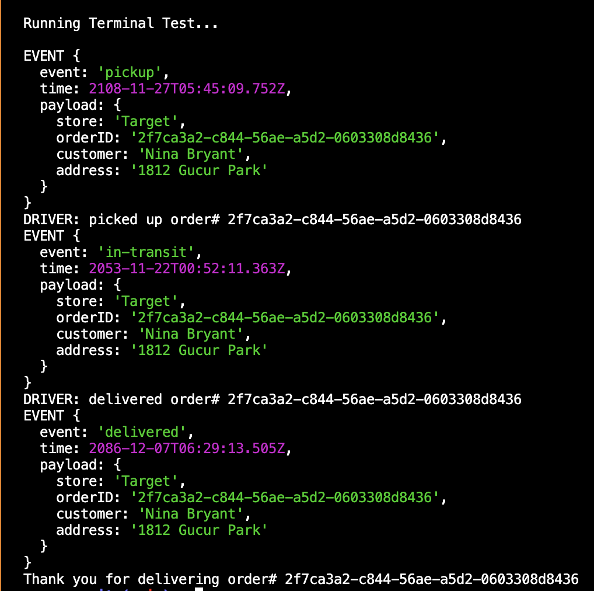
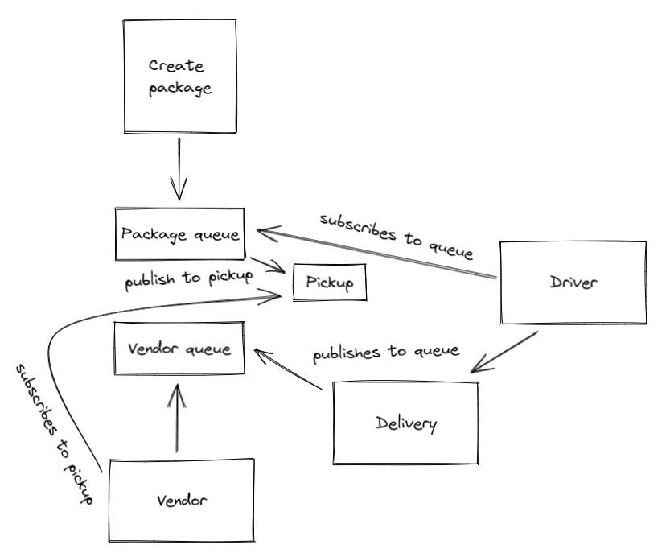

# LAB - 11

## Deployment Test

- [Test Report](https://github.com/dftjr/caps/actions)
- [Heroku](https://dftjr-caps.herokuapp.com/)

### Author

David Tusia

### Setup

- <code>npm i</code> - Required

### Running the app

- This app does not hook up to a live server, this is strictly local based. Please run tests to see actions/outputs.

### Tests

- Unit Tests: <code>npm test</code>
- Terminal Tests: <code>node terminalTest.js </code>
  - Return:

       

### UML

